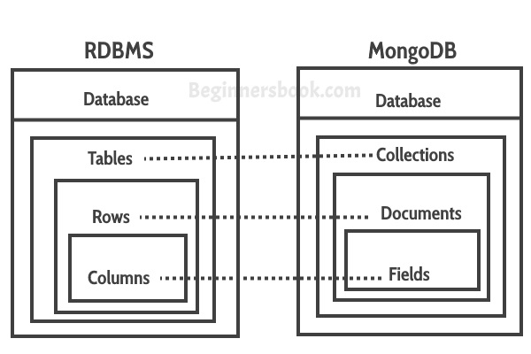

# SCRAPPER-SERVICE

It's the service responsible for scrapping information about conferences and putting all these information into the db storage. Currently the default The `app.py` will be running as a daemon in a micro instance for filling information into a database. Current choice of db is Mongo. THe application can later be extended for different db and index service later.     

## Dev Environment Requirement
*   Any MongoDB installation (ATLAS / Local)
*   Python 3.6+

## Datamodel Schema
*   


## Python packages required
* pymongo driver
* Beautiful Soup
* Requests
* logging (python default)


## Deploying the service

```shell

>> cd Scrapper-Service/

>> python main.py --help
usage: main.py [-h] [-c CONFIG] [-l {debug,warn,error,info}] [-t TEST]
               [-ls {console,file}]

optional arguments:
  -h, --help            show this help message and exit
  -c CONFIG, --config CONFIG
                        Specify config.json file ,default: config.json
  -l {debug,warn,error,info}, --log {debug,warn,error,info}
                        Specify the debug level ,default: debug
  -t TEST, --test TEST  Specify whether to test app initialization or run the
                        scrappers ,default: True
  -ls {console,file}, --logStream {console,file}
                        Specify whether to print logs on terminal or to file
                        ,default: console
```


Jump to `demo.py` for implementing a scrapper from scratch and configuring it to run. 


## How to Contribute ?

* Add new scrappers by implementing the interface Scrapper.py and add the new scrapper information inside the config.json file so that the main.py file can pick up the required class when starting

* Provide better implementation changes to the base design of the service.

* Follow up on the Issues tab for bugs and improvement requirements


